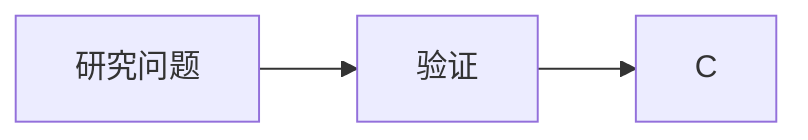
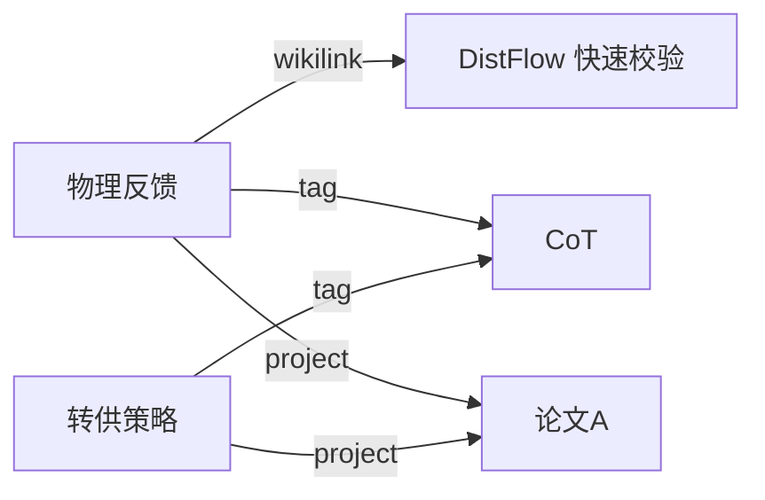
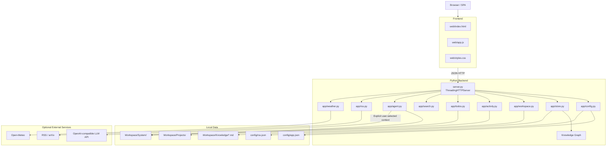
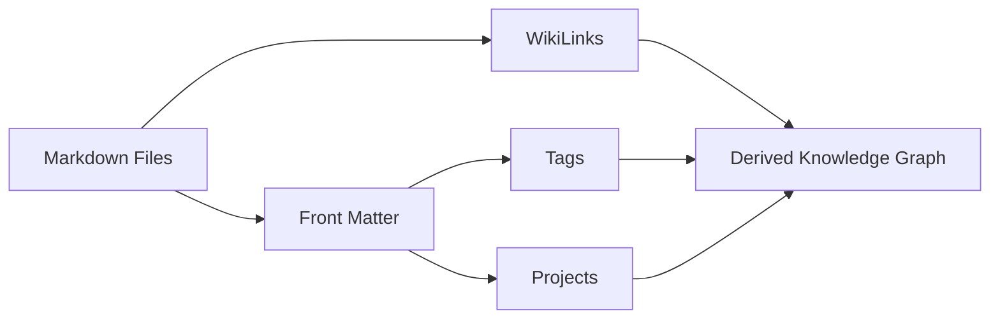
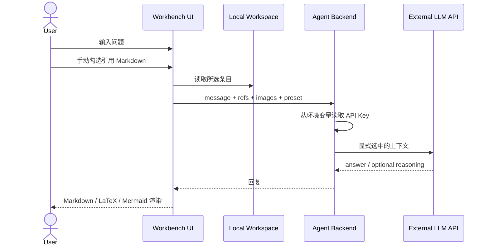

# Engineering Research Workbench

> 一个面向科研人员的本地优先、Markdown-first 工科科研工作台：项目管理、研究笔记、文献卡片、知识图谱、科研时间线、全文检索、RSS 资讯与可引用本地知识的 LLM Agent，统一在一个轻量 Web 界面中完成。

**当前版本：`workbench-v260922.3`**

---

## ✨ 项目简介

Engineering Research Workbench 试图解决一个很具体的问题：

科研过程中，**想法、实验、文献、阶段总结、待办、项目文件、知识关系和 AI 对话往往分散在不同工具中**。当项目持续数月甚至数年后，真正困难的不是“记录一条笔记”，而是：

- 这条想法属于哪个项目？
- 它和哪些文献、实验、笔记有关？
- 某个研究主题过去几个月是如何演化的？
- 能否快速把一个知识节点的一阶 / 二阶关联整理成 Markdown？
- 能否让 LLM 只读取我明确选择的本地资料，而不是把整个知识库交给模型？
- 能否在不引入数据库锁定的前提下，把科研资产长期保留在普通文件系统里？

本项目因此采用：

> **Markdown 作为研究知识主数据，Workspace 作为文件系统主存储，图谱 / 搜索 / 热力图 / Agent 作为派生能力。**

即使未来不再使用本工作台，核心研究资料仍然可以直接使用 VS Code、Obsidian、Typora、Git 或任意文本工具读取。

---

## 🌟 核心特性

### 本地优先 / Markdown-first

- 灵感、研究日志、笔记、里程碑、工作总结、文献均保存为 Markdown。
- 元数据使用 YAML Front Matter。
- 图片落盘到 `Workspace/Knowledge/Attachments/`。
- 项目文件直接保存在普通目录中。
- 不依赖专有数据库才能读取研究内容。

### 科研仪表盘

概览页集中展示：

- 学业 / 博士阶段进度；
- 自定义毕业条件；
- GitHub contribution graph 风格科研热力图；
- 近 1–12 个月动态范围；
- 科研节奏与连续活跃统计；
- 当前待办；
- 近期里程碑；
- 项目推进；
- 最近灵感、笔记和总结；
- 快速记录入口。

科研热力图并非静态装饰，其数据来自本地活动日志，例如：

- Markdown 新建 / 更新；
- 待办创建 / 完成；
- 项目创建；
- 知识汇总；
- BibTeX 导出；
- Agent 对话等。

---

### 项目管理

项目不是一个抽象数据库对象，而是一个真实目录。

新建项目后会自动创建标准工程结构：

```text
Workspace/Projects/<ProjectName>/
├─ Notes/
├─ Experiments/
├─ Data/
├─ Results/
├─ Figures/
├─ Manuscript/
├─ References/
└─ README.md
```

在概览页的 **项目推进** 中可以直接点击 **＋ 新建项目**。

研究条目默认不强制绑定项目。需要关联时，通过项目选择器从已有项目中勾选：

- 默认项目为空；
- 不手动输入不存在的项目名；
- 一个条目可以同时关联多个项目；
- 可随时添加 / 移除关联。

---

### Markdown 研究笔记系统

编辑器支持：

- H1–H6；
- 粗体 / 斜体 / 删除线；
- 有序列表 / 无序列表 / Task List；
- 引用；
- GFM 表格；
- 链接；
- 图片；
- fenced code block；
- 代码高亮；
- 行内 LaTeX；
- 块级 LaTeX；
- Mermaid；
- `[[WikiLink]]`；
- 编辑 / 预览 / 分屏模式；
- 截图粘贴；
- 图片拖拽；
- `Ctrl + S` / `Cmd + S` 保存当前 Markdown。

示例：

```markdown
---
id: note-20260921-demo
kind: note
title: 论文标题
projects: ["论文A", "原型系统"]
tags: ["LLM", "Agent"]
status: 持续维护
---

# 物理反馈反馈

相关潮流方法见 [[DistFlow 快速校验]]。

$$
V_j^2 \approx V_i^2 - 2(r_{ij}P_{ij} + x_{ij}Q_{ij})
$$
```

Mermaid 示例：



---

### 文献管理与 BibTeX

“文献”模块使用 Markdown，而不是把文献卡片锁在单独数据库里。

每篇文献可以维护：

- 标题；
- 作者；
- 年份；
- 期刊 / 会议；
- DOI；
- URL；
- Cite Key；
- 标签；
- 项目；
- 阅读状态；
- 总结；
- 批注；
- BibTeX。

支持多篇文献批量导出 BibTeX：

```text
Workspace/Knowledge/Exports/BibTeX/
```

---

## 🧠 知识图谱

知识图谱由现有 Markdown 自动派生，不需要手动维护一份重复的图数据库。

### 节点类型

当前支持：

- 灵感；
- 研究日志；
- 笔记；
- 里程碑；
- 工作总结；
- 文献；
- 标签；
- 项目。

其中：

- Markdown 条目是实体节点；
- `tag:<name>` 是虚拟标签节点；
- `project:<name>` 是虚拟项目节点。

### 关系类型

图谱包含三类关系：

```text
[[WikiLink]]     → wikilink  / 显式引用
Markdown ↔ Tag   → tag       / 标签关联
Markdown ↔ 项目  → project   / 项目归属
```

例如：



### 图谱筛选

知识图谱页面可以分别控制：

**节点类别**

- 灵感
- 研究日志
- 笔记
- 里程碑
- 工作总结
- 文献
- 标签
- 项目

**关系来源**

- 显式引用
- 标签关联
- 项目归属

2D / 3D 图谱、邻域分析和 Markdown 导出都基于同一份 **filtered graph**：

> 当前图谱显示什么，导出就使用什么。

例如关闭“项目”节点后：

- 项目节点从图中消失；
- 项目边同步消失；
- 一阶 / 二阶邻域不再经过项目；
- 导出的关系索引也不再包含项目关系。

### 节点交互

点击节点后：

- 当前节点放大并加粗；
- 一阶相邻节点高亮；
- 直接相连的边加粗；
- 其它节点和边降低透明度。

点击画布空白处即可退出高亮状态。

### 关联 Markdown 汇总

选择任意文档、标签或项目节点后，可以：

1. 选择一阶 / 二阶邻域；
2. 自动发现当前可见图中的关联 Markdown；
3. 手动勾选 / 取消；
4. 生成总 Markdown；
5. 复制到剪贴板；
6. 保存到：

```text
Workspace/Knowledge/Exports/KnowledgeBundles/
```

非常适合：

- 写论文某一节；
- 做阶段汇报；
- 整理某个标签主题；
- 汇总某个项目资料；
- 为 Agent 构造局部上下文。

---

## 🕒 里程碑与 3D 时间线

里程碑既是 Markdown，又可以切换为时间轴或 3D 时间线。

3D 视图支持：

- 自动缓慢旋转；
- 左键拖动画板；
- `Alt + 拖动` / 右键拖动旋转视角；
- 滚轮缩放；
- 一键复位；
- 暂停 / 恢复自动旋转；
- 点击卡片返回对应里程碑 Markdown。

---

## 🤖 科研 Agent

Agent 是工作台中的本地会话层，用于把外部 LLM 与本地研究资料连接起来。

### Agent 能做什么

- 多轮对话；
- 会话历史；
- 文本输入；
- 图片选择；
- 图片拖拽；
- 截图粘贴；
- Markdown / LaTeX / Mermaid 回复渲染；
- 手动引用研究资料；
- OpenAI-compatible Chat Completions；
- OpenAI Responses API；
- 每轮动态选择请求模式；
- 显示模型请求等待状态与耗时；
- 可选显示兼容接口返回的 reasoning 内容。

### 手动引用本地知识

Agent 不会默认把整个 Workspace 发给模型。

点击：

```text
＋ 引用研究 · 知识
```

可以搜索并勾选：

- 灵感；
- 研究日志；
- 笔记；
- 里程碑；
- 工作总结；
- 文献。

只有：

1. 当前用户消息；
2. 当前附加图片；
3. 用户本轮明确选择的 Markdown；

会作为额外上下文发送给配置的 LLM 服务。

这使 Agent 更接近：

> **可控上下文科研助手**

而不是“自动上传整个知识库”。

---

## 🔐 API Key 与环境变量

工作台不保存真实 API Key。

设置页只保存：

```text
API Key 环境变量名称
```

默认：

```text
OPENAI_API_KEY
```

运行模型调用时，Python 进程从操作系统环境变量中读取真实值。

### 方式一（推荐）：本地私密文件 config/secrets.json

该文件已被 `.gitignore` 排除，不会上传 git。在 `env` 对象中填入 `"环境变量名": "密钥值"`：

```json
{
  "env": {
    "OPENAI_API_KEY": "你的密钥"
  }
}
```

服务运行中保存后自动注入环境变量（按文件修改时间热重载，无需重启），`run.bat` 启动无需每次手动设置 Key。若设置页填写的是其它变量名（如 `DASHSCOPE_API_KEY`），在 `env` 中添加对应条目即可。

> `config/secrets.json` 只存在于本机；工作台不会把 Key 回写到 `config/app.json`、Workspace 或任何接口返回中。

### 方式二：临时环境变量（仅当前会话有效）

### Windows PowerShell

```powershell
$env:OPENAI_API_KEY="your-api-key"
python server.py
```

例如使用其它变量名：

```powershell
$env:DASHSCOPE_API_KEY="your-api-key"
python server.py
```

然后在：

```text
设置 → Agent / LLM → API Key 环境变量名称
```

填写：

```text
DASHSCOPE_API_KEY
```

### Linux / macOS

```bash
export OPENAI_API_KEY="your-api-key"
python3 server.py
```

> API Key 不会被写回 `config/app.json`、Workspace 或 Agent 会话文件。

---

## ⚙️ Agent 请求模式

不同 OpenAI-compatible 服务对“思考模式”的参数定义并不统一。

因此工作台没有把具体供应商参数写死，而是使用 JSON 请求预设。

默认提供：

```json
[
  {
    "id": "default",
    "label": "默认（不附加参数）",
    "params": {}
  },
  {
    "id": "qwen-low",
    "label": "Qwen · 低思考",
    "params": {
      "enable_thinking": true,
      "thinking_budget": 1024
    }
  },
  {
    "id": "qwen-off",
    "label": "Qwen · 无思考",
    "params": {
      "enable_thinking": false
    }
  }
]
```

可以自行配置：

```json
{
  "reasoning_effort": "high"
}
```

或者供应商支持的其它参数。

前端会自动把预设生成成对话框中的下拉选项，每一轮可以动态切换。

为避免错误覆盖关键数据，以下核心字段不会被请求预设覆盖：

- `model`
- `messages`
- `input`
- `instructions`
- `stream`

---

## 💬 Agent 对话体验

发送消息后采用乐观渲染：

```text
用户按 Enter
    ↓
用户消息立即进入对话区
    ↓
输入框立即清空
    ↓
显示“模型正在思考 / 生成回复”
    ↓
显示请求耗时
    ↓
模型回复
```

如果兼容接口返回：

- `reasoning_content`
- `reasoning`
- `thinking`
- `analysis`

工作台可以将其显示为可折叠的：

```text
模型思考过程
```

是否显示可以在 Agent 设置中控制。

如果接口不返回 reasoning，则不会人为生成虚假的思考过程。

---

## 🔎 全局搜索

快捷键：

```text
Ctrl + K
Cmd + K
```

统一搜索：

- Markdown 标题；
- 正文；
- 标签；
- 项目；
- 文献作者；
- DOI；
- Cite Key；
- Todo；
- Agent 会话标题；
- Agent 历史消息。

搜索结果可以直接跳转到对应条目。

---

## 📰 科研资讯

资讯模块支持 RSS / Atom。

默认可配置 arXiv 等科研信息源。

针对 arXiv，后端提供多级回退：

```text
rss.arxiv.org RSS
        ↓ 失败
arXiv Atom API
        ↓ 失败
兼容 HTTP 回退
```

同时：

- 单源短重试；
- 每个源显示抓取状态；
- 显示错误诊断；
- 强制刷新真正重新请求；
- 网络失败时不会用空结果覆盖已有有效缓存；
- 若旧缓存存在，则继续展示旧内容并标记 stale。

因此网络故障不会影响本地 Markdown、图谱和项目管理。

---

## 🌤️ 天气

天气使用 Open-Meteo。

特点：

- 无需 API Key；
- 可配置地点、经纬度和时区；
- 天气请求故障不影响核心本地功能。

---

## ⏱️ 专注计时

支持：

- 自定义专注时长：1–240 分钟；
- 自定义休息时长：1–120 分钟；
- 25 / 45 / 60 / 90 分钟快速预设；
- 本地保存设置；
- 环形进度显示。

---

# 🏗️ 系统架构

项目采用轻量的 Browser SPA + Python 标准库 HTTP Server 架构。



---

## 前端

核心文件：

```text
web/
├─ index.html
├─ app.js
└─ styles.css
```

职责包括：

- 单页路由；
- 侧边栏；
- 仪表盘；
- Markdown 编辑器；
- 2D / 3D 图谱；
- 3D 时间线；
- Agent UI；
- 搜索；
- 设置中心；
- 页面动画；
- 热力图。

---

## 后端

后端基于 Python 标准库 `ThreadingHTTPServer`。

```text
server.py
└─ app/
   ├─ config.py
   ├─ workspace.py
   ├─ store.py
   ├─ activity.py
   ├─ todos.py
   ├─ search.py
   ├─ agent.py
   ├─ rss.py
   └─ weather.py
```

### `app/config.py`

负责：

- 应用配置；
- RSS 配置；
- Agent 配置；
- 环境变量 Key 状态；
- Reload。

### `app/workspace.py`

负责：

- Workspace 初始化；
- 项目目录创建；
- 项目文件树；
- 路径边界；
- 旧数据迁移。

### `app/store.py`

核心研究数据层：

- Markdown CRUD；
- Front Matter；
- 图片附件；
- 文献 / BibTeX；
- 项目；
- 标签；
- WikiLink；
- 知识图谱；
- 邻域；
- Knowledge Bundle；
- Dashboard 聚合。

### `app/activity.py`

append-only 科研活动日志：

```text
Workspace/System/activity.jsonl
```

用于：

- 科研热力图；
- 本月活跃；
- 连续活跃；
- 科研节奏。

### `app/search.py`

统一搜索：

```text
Markdown + Todo + Agent History
```

### `app/agent.py`

负责：

- Agent 会话；
- 图片附件；
- 手动知识引用；
- 请求预设；
- OpenAI-compatible 调用；
- Responses API；
- reasoning 提取；
- 环境变量 API Key。

### `app/rss.py`

负责：

- RSS；
- Atom；
- arXiv fallback；
- 缓存；
- 错误诊断。

### `app/weather.py`

负责 Open-Meteo 天气。

---

# 📁 Workspace 设计

首次启动后会创建：

```text
Workspace/
├─ Knowledge/
│  ├─ Ideas/
│  ├─ Journals/
│  ├─ Notes/
│  ├─ Milestones/
│  ├─ Summaries/
│  ├─ Literature/
│  ├─ Attachments/
│  └─ Exports/
│     ├─ KnowledgeBundles/
│     └─ BibTeX/
│
├─ Projects/
│  └─ <ProjectName>/
│     ├─ Notes/
│     ├─ Experiments/
│     ├─ Data/
│     ├─ Results/
│     ├─ Figures/
│     ├─ Manuscript/
│     ├─ References/
│     └─ README.md
│
├─ Resources/
│
└─ System/
   ├─ Cache/
   ├─ Trash/
   ├─ AgentChats/
   │  ├─ Attachments/
   │  └─ Trash/
   ├─ todos.json
   └─ activity.jsonl
```

---

# 🗃️ Markdown 数据模型

典型 Markdown：

```yaml
---
id: note-20260921-abcd
kind: note
title: CoT
created: "2026-09-21T09:00:00"
updated: "2026-09-21T10:30:00"
status: 持续维护

project: 论文A
projects:
  - 论文A
  - 原型系统

tags:
  - LLM
  - Agent

pinned: false
---
```

正文：

```markdown
# 快速反馈

快速反馈模块使用 [[DistFlow 快速校验]]。

下一步需要验证 [[物理反馈状态]] 的稳定性。
```

其中：

- `project`：兼容旧数据的第一主项目；
- `projects`：完整多项目列表；
- `tags`：知识主题；
- `[[WikiLink]]`：显式知识关系。

---

# 🔄 核心数据流

## Markdown → Knowledge Graph



图谱不是独立主数据库，因此不会产生：

> Markdown 改了，但图数据库没同步

这样的双主数据问题。

---

## Local Knowledge → Agent



---

# 🚀 快速开始

## 1. Clone

```bash
git clone https://github.com/Smooling/engineering-research-workbench.git
cd engineering-research-workbench
```

## 2. 启动

### Windows

```powershell
python server.py
```

或：

```powershell
.\run.bat
```

### Linux / macOS

```bash
python3 server.py
```

如果使用脚本：

```bash
chmod +x run.sh
./run.sh
```

打开：

```text
http://127.0.0.1:8765
```

---

# ⚙️ 配置

主要配置文件：

```text
config/
├─ app.json
└─ rss.json
```

### `config/app.json`

包含：

- 工作台名称；
- 端口；
- Workspace 路径；
- 学业进度；
- 天气；
- UI；
- Agent / LLM；
- 请求预设。

### `config/rss.json`

包含：

- RSS / Atom 地址；
- 是否启用；
- 每个源最大条数。

---

# 🔌 主要 HTTP API

以下为主要接口示例，并非完整 API 文档：

| Endpoint                        | 用途              |
| ------------------------------- | ----------------- |
| `GET /api/health`             | 健康检查          |
| `GET /api/config`             | 获取脱敏配置      |
| `POST /api/config/app`        | 保存应用配置      |
| `GET /api/docs`               | 查询 Markdown     |
| `POST /api/docs`              | 创建 Markdown     |
| `GET /api/graph`              | 生成知识图谱      |
| `POST /api/graph/bundle`      | 生成关联 Markdown |
| `GET /api/search?q=`          | 全局搜索          |
| `GET /api/projects`           | 项目列表          |
| `POST /api/workspace/project` | 创建项目          |
| `GET /api/agent/sessions`     | Agent 会话列表    |
| `POST /api/agent/send`        | 发送 Agent 消息   |
| `GET /api/rss`                | 科研资讯          |
| `GET /api/weather`            | 天气              |

---

# 🧪 自检

项目提供自检：

```bash
python tools/self_check.py
```

覆盖内容包括：

- Workspace 自动创建；
- Markdown CRUD；
- 全文搜索；
- 多项目；
- 标签；
- WikiLink；
- 知识图谱；
- 一阶 / 二阶关联；
- 图谱筛选导出；
- BibTeX；
- 图片；
- Todo；
- Agent 会话；
- 图文请求；
- 请求预设；
- reasoning；
- 环境变量 API Key；
- 科研热力图；
- RSS / arXiv fallback；
- Python 语法；
- JavaScript 语法。

---

# 🔒 隐私与安全说明

本项目以本地使用为主要场景，但仍需注意：

### 默认保留在本地

- Markdown；
- 项目文件；
- Todo；
- Agent 历史记录；
- 科研活动日志；
- 图片附件；
- 知识图谱派生关系。

### 会离开本机的内容

仅在使用外部服务时：

**LLM**

- 当前问题；
- 当前附加图片；
- 本轮手动选择的 Markdown 上下文。

**RSS / 天气**

- HTTP 请求本身。

如果研究数据涉及：

- 未公开论文；
- 企业项目；
- 保密实验；
- 未公开数据集；

请根据所使用 LLM 服务商的隐私和数据保留政策决定是否发送。

---

# 🧩 设计原则

### 1. Markdown is the source of truth

研究知识不依赖数据库才能读取。

### 2. Local-first

外部 LLM、天气、RSS 全部属于可选增强能力。

### 3. Explicit over implicit

图谱关系优先来自：

- WikiLink；
- 标签；
- 项目。

不会默认让 LLM 自动生成不可追踪的知识关系。

### 4. Human-in-the-loop

关联 Markdown 和 Agent 上下文最终由用户勾选。

### 5. Derived views are disposable

图谱、热力图和搜索索引可以重新生成，原始 Markdown 不受影响。

### 6. Failure isolation

RSS、天气或外部模型不可用时，不应影响 Markdown 和 Workspace 主流程。

---

# 📌 当前适用场景

这个工作台尤其适合：

- 博士 / 硕士长期科研项目；
- 多篇论文并行推进；
- 工科实验记录；
- 算法方案迭代；
- 文献精读；
- 科研项目管理；
- Markdown 知识库；
- 使用 LLM 辅助科研但希望控制本地上下文的用户。

---

# ⚠️ 当前边界

本项目当前定位是：

> **单用户、本地优先科研工作台。**

目前不重点解决：

- 多用户权限系统；
- 云端协同编辑；
- 企业级身份认证；
- 大规模数据库集群；
- 自动语义向量数据库；
- 自动将整个知识库上传给 LLM。

知识图谱当前主要是显式关系图，而不是自动 embedding / semantic graph。

---

# 🛠️ 开发目录

```text
.
├─ app/
│  ├─ activity.py
│  ├─ agent.py
│  ├─ config.py
│  ├─ rss.py
│  ├─ search.py
│  ├─ store.py
│  ├─ todos.py
│  ├─ weather.py
│  └─ workspace.py
│
├─ config/
│  ├─ app.json
│  └─ rss.json
│
├─ docs/
│  └─ ARCHITECTURE.md
│
├─ tools/
│  └─ self_check.py
│
├─ web/
│  ├─ app.js
│  ├─ index.html
│  └─ styles.css
│
├─ Workspace/
├─ CHANGELOG.md
├─ VERSION
├─ run.bat
├─ run.sh
└─ server.py
```

---

# 🗺️ Roadmap

一些适合后续继续扩展的方向：

- [ ] 标签自动补全 / 标签管理；
- [ ] 引用关系类型细分；
- [ ] 可选语义关联推荐；
- [ ] 用户确认后再写入 AI 推荐关系；
- [ ] 项目级 Agent Context；
- [ ] 实验数据索引；
- [ ] Git Commit / 文件修改与科研热力图联动；
- [ ] Markdown 模板系统；
- [ ] 文献 DOI / BibTeX 自动补全；
- [ ] Agent 流式输出；
- [ ] 更完整的 OpenAI-compatible provider presets；
- [ ] 数据备份 / 导入 / 导出；
- [ ] PWA / 桌面端封装。

---

# 🤝 Contributing

欢迎通过 Issue / Pull Request 提交：

- Bug；
- UI 改进；
- Markdown 编辑能力；
- 知识图谱增强；
- OpenAI-compatible Provider 适配；
- RSS / 文献源；
- 科研工作流建议。

提交代码前建议运行：

```bash
python tools/self_check.py
```

---

## Acknowledgements

本项目受到本地优先知识管理、Markdown 笔记系统、知识图谱、科研工作流与现代 LLM Agent UI 的启发。

核心目标始终是：

> **让科研资料保持可读、可迁移、可追踪，同时让 AI 成为研究工作流中的可控增强层，而不是新的数据孤岛。**
